SESION 3

Github-dsa069

UsuarioGithub: dsa069

Repositorio con los md con las capturas de las actividades de los 2 pdf: https://github.com/dsa069/hmis-repo01.git 

Repositorio 1: https://github.com/dsa069/hmis-repo01.git  

Repositorio 2: https://github.com/dsa069/dsa069.github.io.git

Repositorio 3: https://github.com/dsa069/ualhmis.github.io.git

1.	Hello World:

Repositorio: https://github.com/dsa069/hmis-repo01.git  

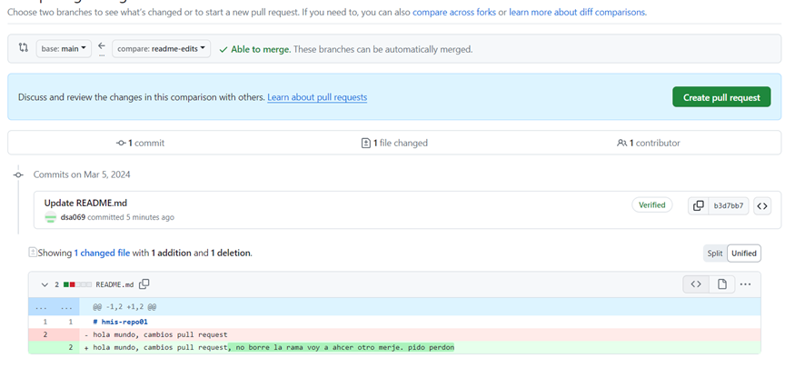
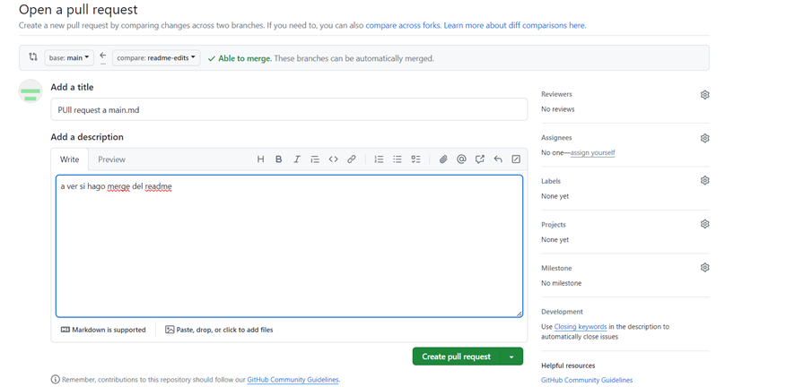
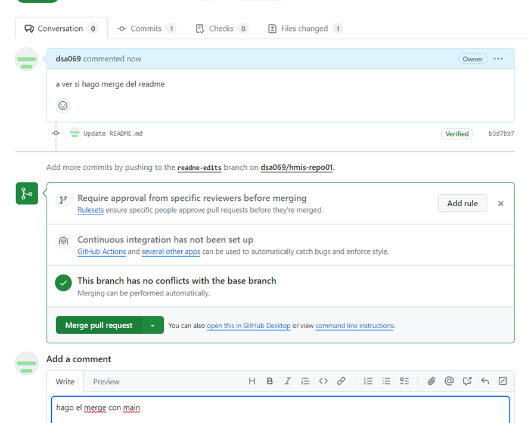
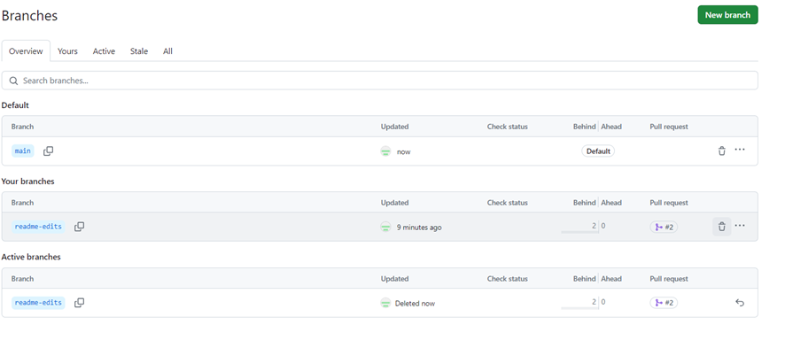
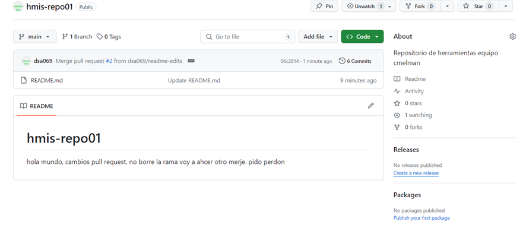

Como vemos se ha realizado el merge correctamente, ya que el contenido de la otra rama ahora se encuentra en el main.

2.  Guithub Pages:

Repositorio: https://github.com/dsa069/dsa069.github.io.git

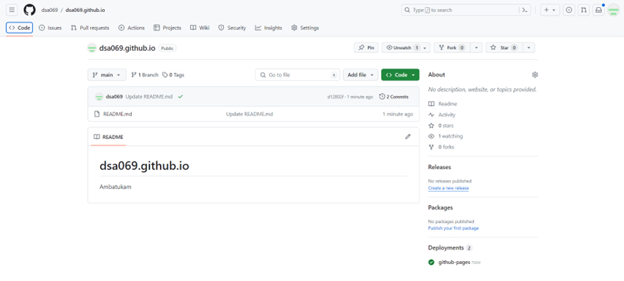
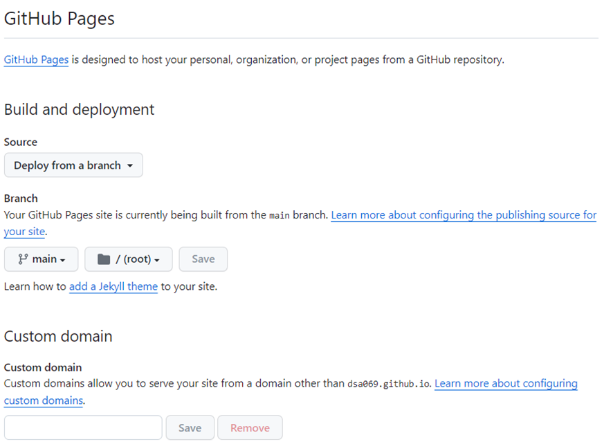
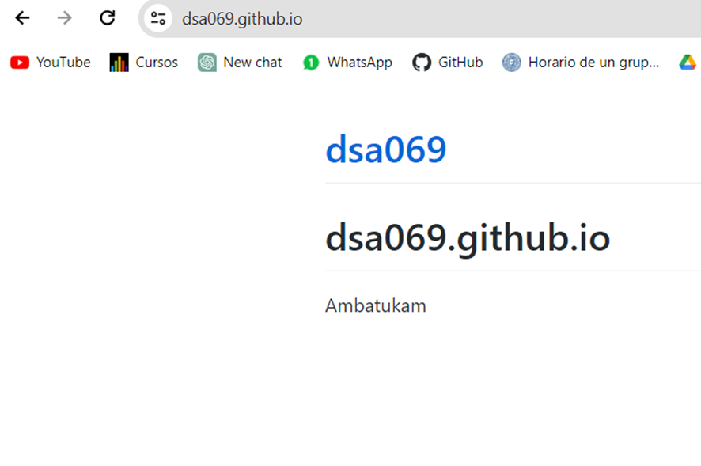
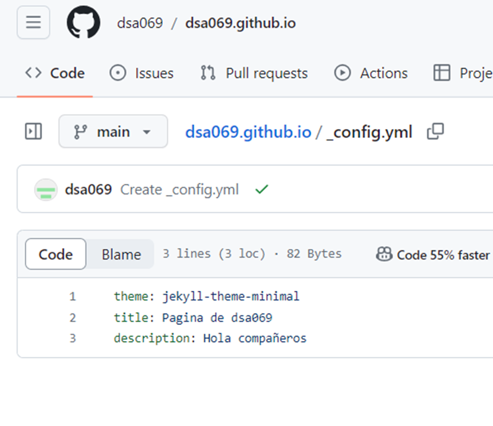
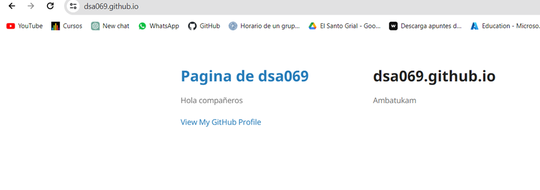

Como podemos obervar se ha generado lapagina web correctamente con los parametros correspondientes

3.  Forking:

Repositorio: https://github.com/dsa069/ualhmis.github.io.git

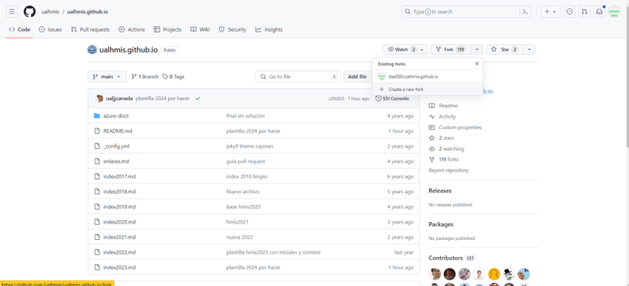
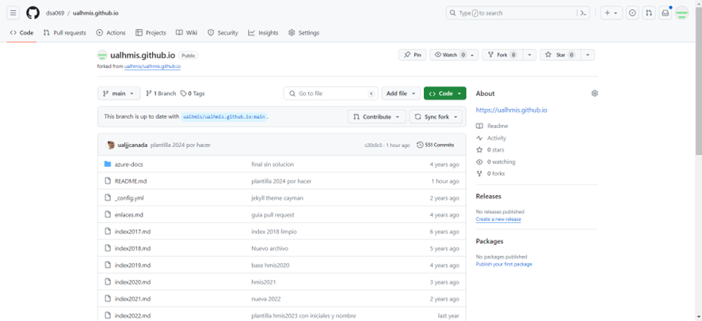
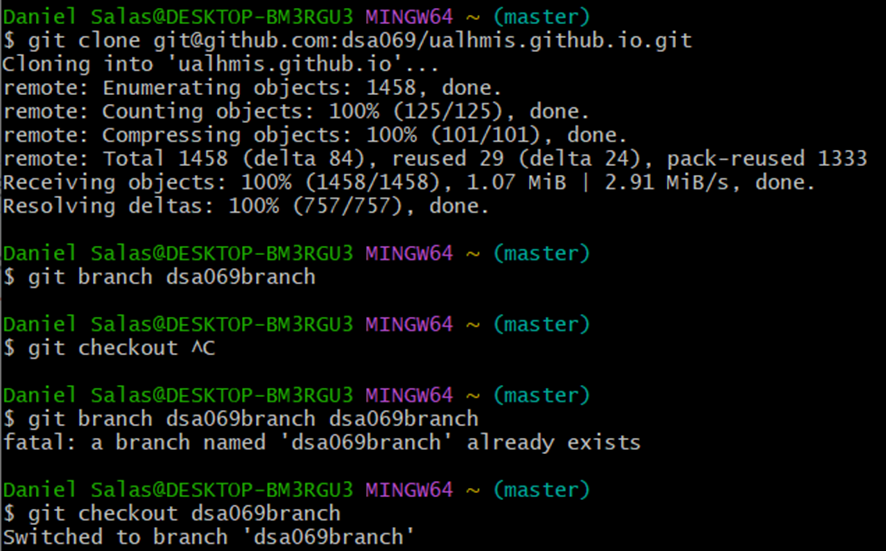
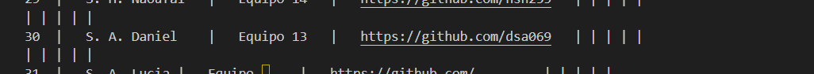
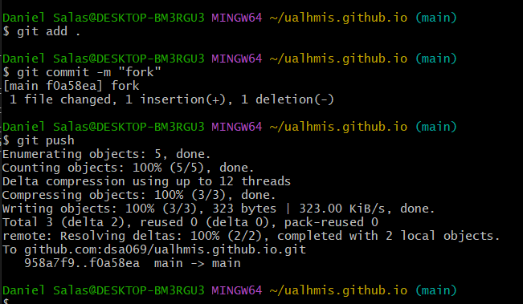
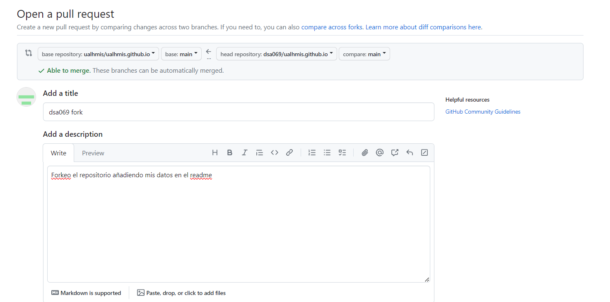
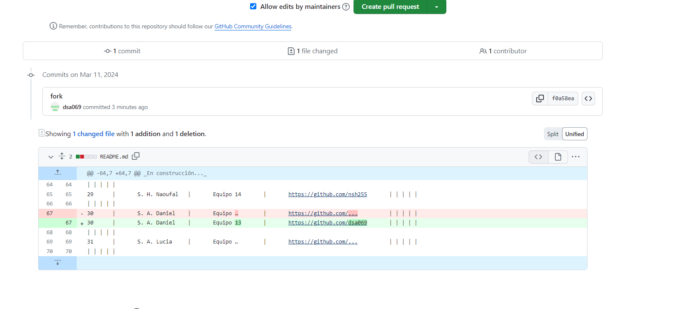
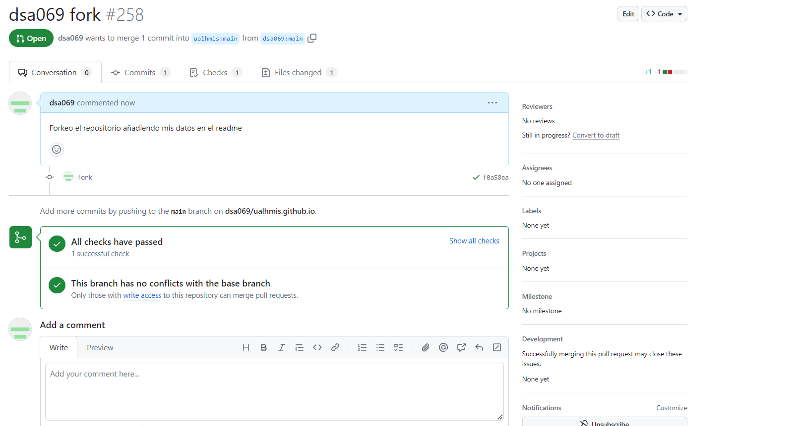