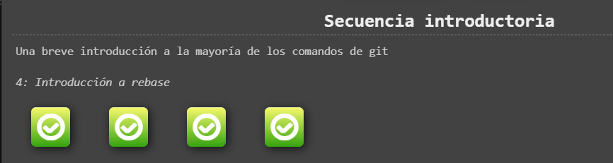
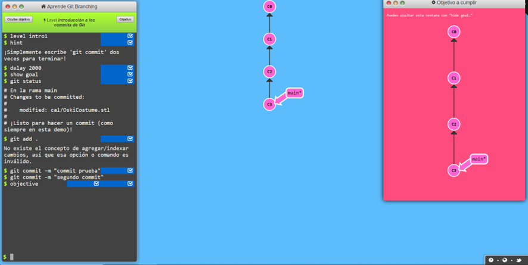
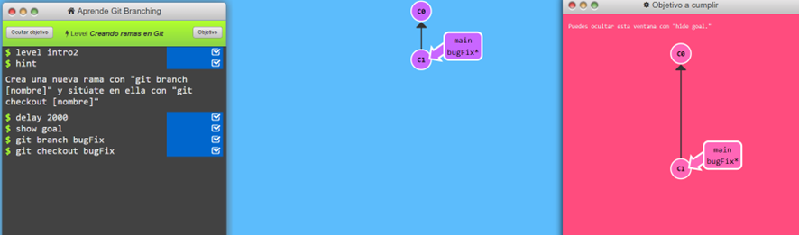
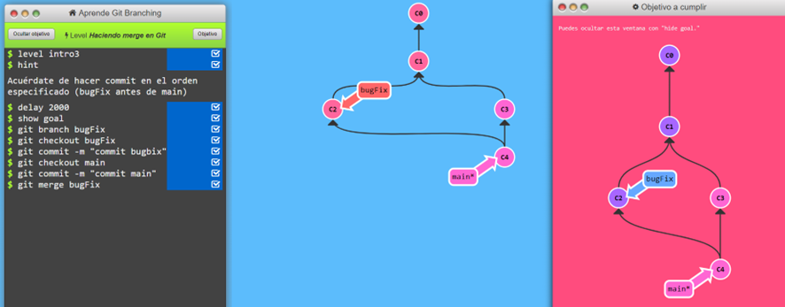
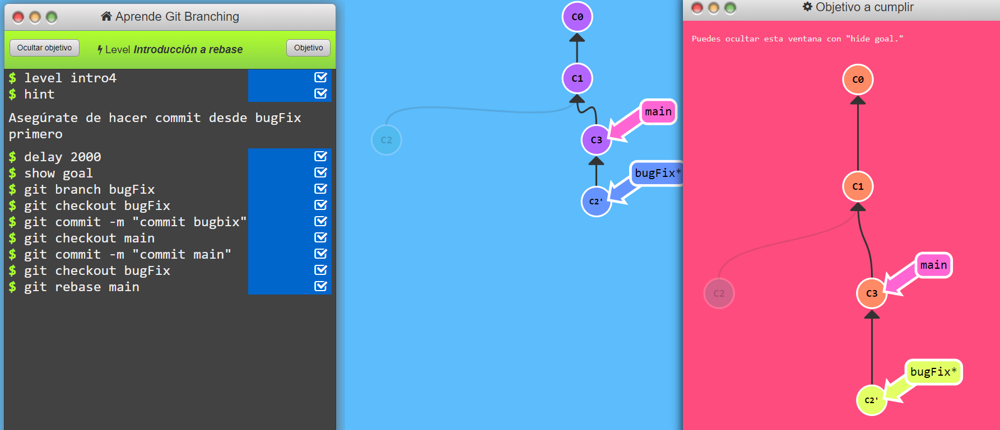
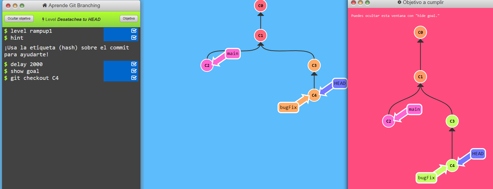
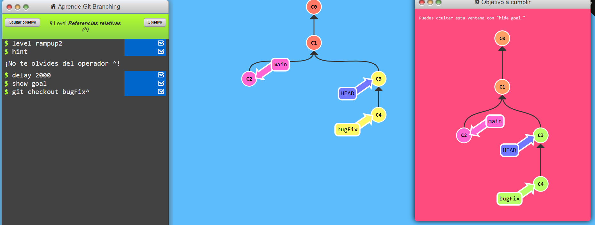
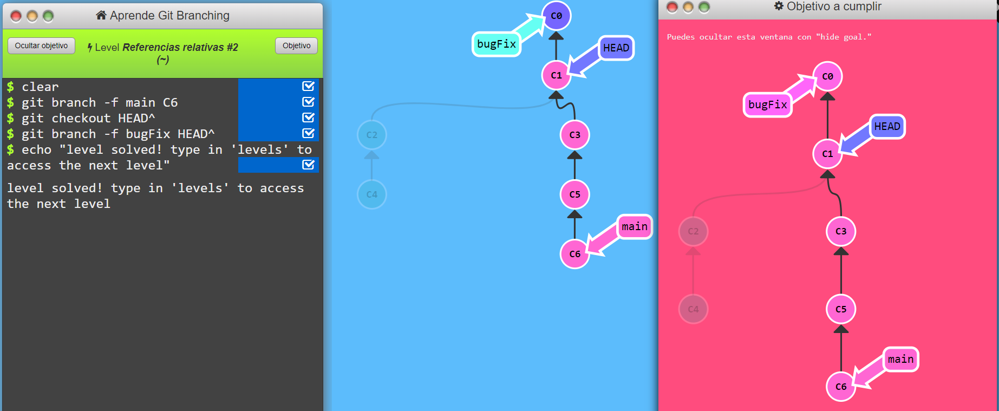

LearnGitBranching-dsa069

1.	Principal:

    1.1.	Secuencia introductoria

    

        1.1.1.
    

        1.1.2.	
    

        1.1.3.	
    

        1.1.4.
    

    1.2.	Acelerando

        1.2.1.	
    

        1.2.2.	
    

        1.2.3.	
    
    
        1.2.4.	
    1.3.	Moviendo el trabajo por ahí

        1.3.1.	
        1.3.2.	
    1.4.	Un poco de todo

        1.4.1.	
        1.4.2.	
        1.4.3.	
        1.4.4.	
        1.4.5.	
    1.5.	Temas Avanzados

        1.5.1.	
        1.5.2.	
        1.5.3.	
2.	Remota:

    2.1.	Push and Pull

        2.1.1.	
        2.1.2.	
        2.1.3.	
        2.1.4.	
        2.1.5.	
        2.1.6.	
        2.1.7.	
        2.1.8.	
    2.2.	Hasta el origen y más allá

        2.2.1.	
        2.2.2.	
        2.2.3.	
        2.2.4.	
        2.2.5.	
        2.2.6.	
        2.2.7.	
        2.2.8.	

